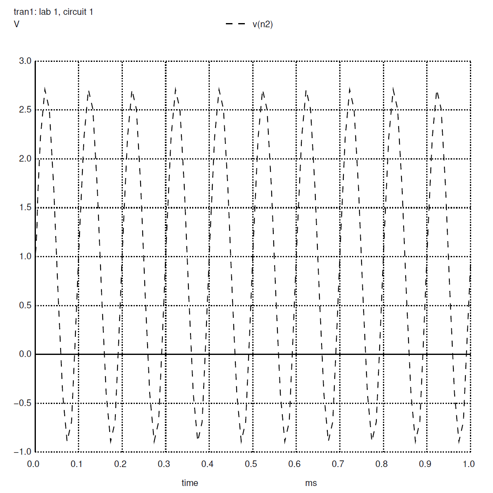
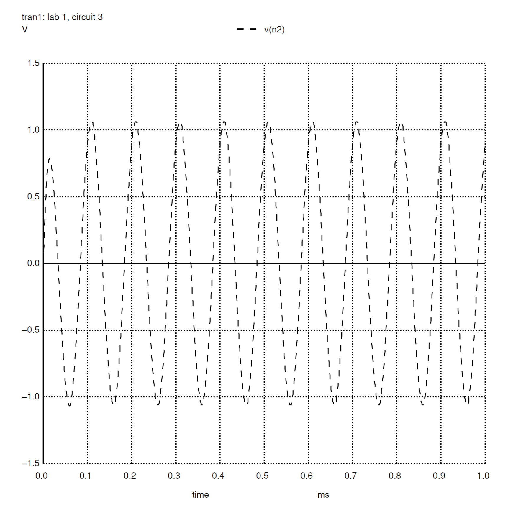

# Lab 1  
## Introduction  
This lab prepares materials needed for the semesters' lab assignments, reviews techniques/procedures required for professional laboratory work, and provides experience using a function generator, power supply, oscilloscope, and multimeter. Each resistor utilized in this lab was analyzed to determine the precise resistance each provided. These measurements demonstrated that each resistor did not contain the exact resistance advertized along the resistors' bodies. Afterward, the function generator was utilized alongside the oscilloscope to demonstrate how the changes in the function generator impact the output displayed on the oscilloscope. The oscilloscope displayed the sine wave and the magnitude spectrum input by the function generator. This measurement process continued throughout the experiment to measure Figure 1.1, Figure 1.2, and Figure 1.3, as seen below.  

**Figure 1.1: Voltage Divider**  
 

**Figure 1.2: Low-Pass Filter**  
  

**Figure 1.3: High Pass Filter**  

The Pre-Lab Analysis performed before the experiment aligned with the experiment, aside from slight differences discussed in the body of this report. A Spice simulation was also performed on Figure 1.1, Figure 1.2, and Figure 1.3. The list of equipment utilized during this lab can be found in Appendix A at the bottom of this report. The list of components and materials utilized during this lab can be found in Appendix B at the bottom of this report.  

## Pre-Lab Analysis  
The pre-lab analysis involved calculating the magnitude spectrum of our voltage input in Exercise 1, then utilizing that voltage input for ascertaining an expression for the voltage output for the circuit shown in Figure 1.1, then calculating the 3 dB cutoff frequency of Figure 1.2, and Figure 1.3 in Exercise 3 and Exercise 4. Each exercise maintained the same voltage input.  

The goal of Exercise 1 was to describe the magnitude spectrum of the voltage input using a frequency of 10 kHz. The result of the calculations identified an impulse response at 0 Hz and another impulse response at 107 Hz. The expression determined in Exercise 2 identified an offset of 0.90909... V and a peak-to-peak amplitude of 1.818... V.  

In Exercise 3, a Low-Pass Filter (Figure 1.2) was examined to identify the 3 dB cutoff frequency. The calculations determined the 3 dB cutoff frequency was 15.92 kHz. In Exercise 4, a High-Pass Filter (Figure 1.3) was examined to identify the 3 dB cutoff frequency. The calculations determined the 3 dB cutoff frequency was 15.92 kHz.  

## Simulation Results  
The SPICE simulations performed for this experiment included plotting the output voltage for Figure 1.1, Figure 1.2, and Figure 1.3. In addition, the SPICE simulation produced a bode plot, phase plot, 3 dB cutoff frequency, and the phase shift for Figure 1.2 and Figure 1.3. As in the pre-lab analysis, the SPICE simulations analyzed the circuits with a 1 V offset and a 2 V amplitude, while testing three different frequencies (1 kHZ, 10 kHZ, and 50 kHz). The magnitude spectrum graph created in the pre-lab included impulse responses in the form of delta functions; the SPICE simulation plots the magnitude spectrum along a continuous line, but both results lead to a phase of 45 degrees and activity along 0 Hz and 107 Hz. These conclusions also match the graphs produced by the oscilloscope during the physical experiment. See the Appendices for the graphs produced from the SPICE simulation.  

When running NGSpice in the command line for circuit 1 (Figure 1.1), the terminal returns y = 9.090909e-01 and `vout = vin*0.909091`. This calculation matches the calculations in the prelab analysis of Exercise 2 where the offset was determined to be 0.9090909... V.  

When running NGSpice in the command line for circuit 2 (Figure 1.2), the values returned by the terminal can be found in Appendix C below. These values match directly with the pre-lab analysis results.  

When running NGSpice in the command line for circuit 3 (Figure 1.3), the values returned by the terminal can be found in Appendix D below. These values match directly with the pre-lab analysis results.  

## Experimental Results  
During the experiment, the circuits described in Figure 1.1, Figure 1.2, and Figure 1.3 were physically tested using an oscilloscope, digital multimeter, and a function generator. First, the 1 kOhms resistor and the 10 kOhms resistor were measured for resistance using the digital multimeter. The 1 kOhms resistor utilized for this experiment measured to 1.080 kOhms. The 10 kOhms resistor measured to 9.95 kOhms.

Next, the function generator was calibrated by connecting the function generator to the oscilloscope. The function generator was calibrated to match the following equation: `Vin = 1 V + (2V)sin(2*pi*f*t)`. This is the equation provided in Exercise 1 of the pre-lab analysis. Utilizing the measure function on the oscilloscope, the signal's frequency measured 10.04 kOhms. The peak-to-peak measurement was 2.00 V. The offset voltage was 1.05 V.

When adjusting the Seconds/Div and Volts/Div knobs to set the oscilloscope to 50 kS/s and 10 dB per division, the magnitude spectrum graph matched the expectations set forth during the pre-lab analysis. The graph contained a spike at 0 Hz and 107 Hz. The only difference between our expectations and the results would be many small spikes along the x-axis of the graph and a third peak. This graph can be seen below.

**Figure 2.1: Magnitude Spectrum - Sine Wave**  

Afterward, we set the function generator's signal type to a square wave to observe changes in the graph. The square wave amplified the third peak and rounded out the spikes along the x-axis. The square wave graph can be seen below.

**Figure 2.2: Magnitude Spectrum - Square Wave**  

The next step required changing the signal type again. This time the signal type was set to a triangle wave. The triangle wave graph resembled the square wave graph, aside from the third impulse spike being larger with the triangle wave setting. The triangle wave graph can be seen below.

**Figure 2.3: Magnitude Spectrum - Triangle Wave**  

Afterward, the experiment introduced a breadboard to connect the two resistors previously measured as depicted in Figure 1.1. The breadboard connected to the function generator for input and the oscilloscope to measure the output. After adjusting the channels to display 1 V per division and positioning the signals to match their reference points, the following graph and measurements were produced.

**Figure 3: Voltage Divider Measurements**  

For Channel 1 (Vin), the peak-to-peak voltage was 2.16 V and the offset was 1.84 V. For Channel 2 (Vout), the peak-to-peak voltage was 1.52 V and the offset was 1.55 V. These values match the values presented in the pre-lab with a slight variation likely caused by the resistors not measuring exactly as they are labeled.

The remainder of the experiment involved assembling Figure 1.2 then Figure 1.3 on the breadboard to measure the cutoff frequency. During this process, the input frequency was set to 1 kHz. For Figure 1.2, the cutoff frequency according to the pre-lab analysis is about 15.92 kHz. The oscilloscope measured a cutoff frequency of 15.88 kHz. The graph outputted by the oscilloscope can be seen below.

**Figure 4: Low-Pass Filter Cutoff Frequency**  

For Figure 1.3, the cutoff frequency according to the pre-lab analysis is about 15.92 kHz. The oscilloscope measured a cutoff frequency of 15.98 kHz. The graph outputted by the oscilloscope can be seen below.

**Figure 5: High-Pass Filter Cutoff Frequency**  

A plausible explanation to the discrepancy in the measurements from the pre-lab analysis compared to the oscilloscope output results from the physical resistor's resistance being different than the resistance utilized in the paper measurements. In addition, this experiment did not allow for measuring the capacitance of the capacitor. This results in unknown information in our data.

In the end, the phenomenon of aliasing was introduced by utilizing the oscilloscope. As the frequency was increased, the measurement would eventually repeat on the graph. This may affect future lab experiments as apparent frequency being lower than the actual frequency could result in a misinterpretation of the data.

## Conclusions  
This lab consisted of analyzing a voltage divider, low-pass filter, and a high-pass filter. Generally, the measured results from the pre-lab matched the output produced during the experiment section. The times when an unexpected measurement occurred, it was due to the real-world measurements of resistors and capacitors being different than the virtual calculations. The grand conclusion of this lab points to the fact that the mathematical formulas provided in textbooks can only be used as approximations because the real-world is rarely as perfect as it is on paper.

## Appendix: Data Tables  
### Appendix A: List of Equipment  
| Equipment |
| :----------------- |
| Digital Multimeter |
| Oscilloscope |
| Oscilloscope Probe |
| Function Generator |
| Banana-to-alligator Cables |
| BNC-to-BNC Cables |
| BNC-to-Alligator Cables |

### Appendix B: List of Components and Materials  
| Components and Materials | Description |
| ------------------------ | :---------: |
| Resistor(s): | 10 kOhm (1) |
|  | 1kOhm (1) |
| Capacitor(s): | 1 nF (1) |
| Breadboard | Solderless Breadboard (1) |

### Appendix C: Circuit 2 NGSpice Results
| Variable | Value |
| :------- | :-------: |
| y1 | -1.711150e-02 V |
| y2 | -1.445070e+00 V |
| y3 | -1.036042e+01 V |
| f3db | 1.587800e+04 Hz |
| p3db | -4.492628e+01 degrees |

### Appendix D: Circuit 3 NGSpice Results
| Variable | Value |
| :------- | :-------: |
| y1 | -2.405351e+01 V |
| y2 | -5.481473e+00 V |
| y3 | -4.198595e-01 V |
| f3db | 1.598052e+04 Hz |
| p3db | 4.491032e+01 degrees |

### Appendix E: Figure 1.1 SPICE Simulation Graphs  

**Figure 1.1.1: Vout DC Simulation**  

**Figure 1.1.2: Vout Transient Simulation**  

### Appendix F: Figure 1.2 SPICE Simulation Graphs  

**Figure 1.2.1: Vout Transient Simulation**  

**Figure 1.2.2: Magnitude Spectrum**  

**Figure 1.2.3: Phase Shift**  

### Appendix G: Figure 1.3 SPICE Simulation Graphs  

**Figure 1.3.1: Vout Transient Simulation**  

**Figure 1.3.2: Magnitude Spectrum**  

**Figure 1.3.3: Phase Shift**  
