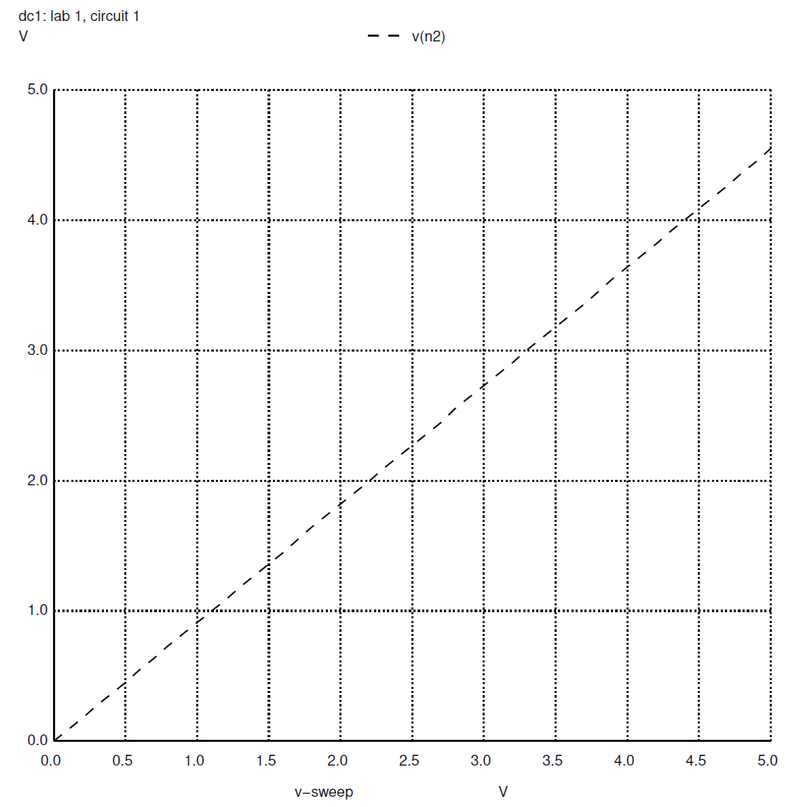
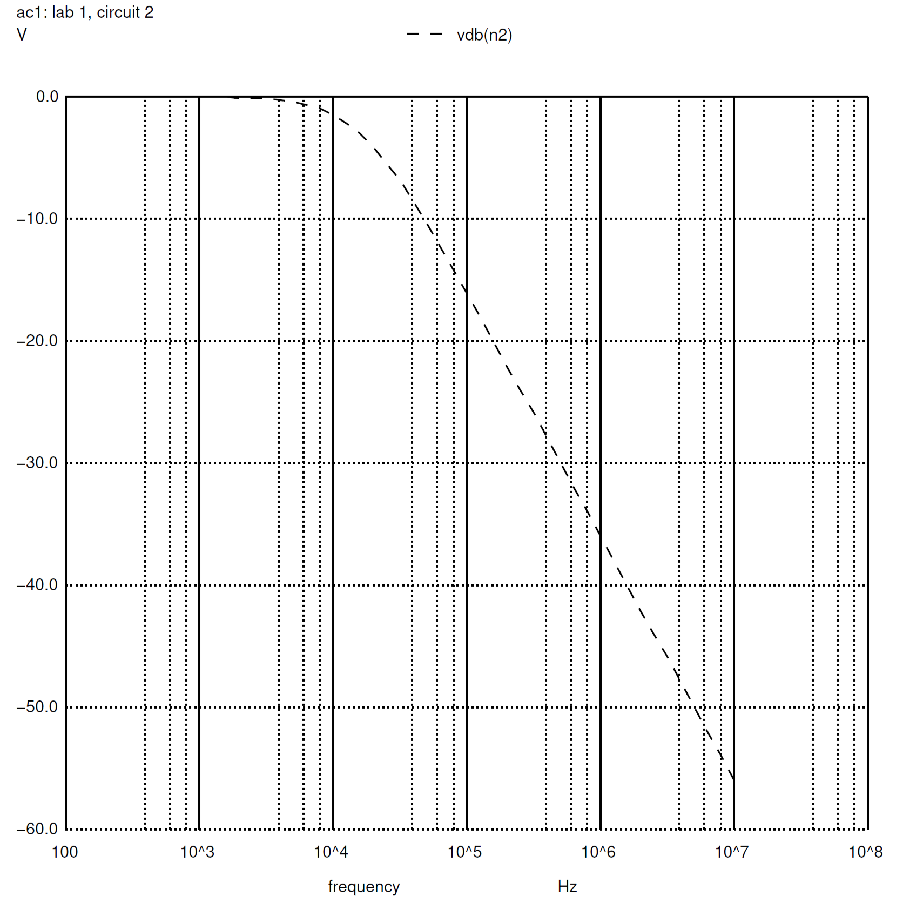

# Lab 1  
## Introduction  
This lab prepares materials needed for the semesters' lab assignments, reviews techniques/procedures required for professional laboratory work, and provides experience using a function generator, power supply, oscilloscope, and multimeter. Each resistor utilized in this lab was analyzed to determine the precise resistance each provided. These measurements demonstrated that each resistor did not contain the exact resistance advertized along the resistors' bodies. Afterward, the function generator was utilized alongside the oscilloscope to demonstrate how the changes in the function generator impact the output displayed on the oscilloscope. The oscilloscope displayed the sine wave and the magnitude spectrum input by the function generator. This measurement process continued throughout the experiment to measure Figure 1.1, Figure 1.2, and Figure 1.3, as seen below.

  
**Figure 1.1**  

  
**Figure 1.2: Low Pass Filter**  

  
**Figure 1.3: High Pass Filter**  

The Pre-Lab Analysis performed before the experiment aligned with the experiment, aside from slight differences discussed in the body of this report. A Spice simulation was also performed on Figure 1.1, Figure 1.2, and Figure 1.3. The list of equipment utilized during this lab can be found in Appendix A at the bottom of this report. The list of components and materials utilized during this lab can be found in Appendix B at the bottom of this report.  

## Pre-Lab Analysis  
The pre-lab analysis involved calculating the magnitude spectrum of our voltage input in Exercise 1, then utilizing that voltage input for ascertaining an expression for the voltage output for the circuit shown in Figure 1.1, then calculating the 3 dB cutoff frequency of Figure 1.2, and Figure 1.3 in Exercise 3 and Exercise 4. Each exercise maintained the same voltage input.  

The goal of Exercise 1 was to describe the magnitude spectrum of the voltage input using a frequency of 10 kHz. The result of the calculations identified an impulse response at 0 Hz and another impulse response at 107 Hz. The expression determined in Exercise 2 identified an offset of `0.90909... V` and a peak-to-peak amplitude of `1.818... V`.  

In Exercise 3, a Low-Pass Filter (Figure 1.2) was examined to identify the 3 dB cutoff frequency. The calculations determined the 3 dB cutoff frequency was `15.92 kHz`. In Exercise 4, a High-Pass Filter (Figure 1.3) was examined to identify the 3 dB cutoff frequency. The calculations determined the 3 dB cutoff frequency was `15.92 kHz`.  

## Simulation Results  
The SPICE simulations performed for this experiment included plotting the output voltage for Figure 1.1, Figure 1.2, and Figure 1.3. In addition, the SPICE simulation produced a bode plot, phase plot, 3 dB cutoff frequency, and the phase shift for Figure 1.2 and Figure 1.3. As in the pre-lab analysis, the SPICE simulations analyzed the circuits with a 1 V offset and a 2 V amplitude, while testing three different frequencies (1 kHZ, 10 kHZ, and 50 kHz). The magnitude spectrum graph created in the pre-lab included impulse responses in the form of delta functions; the SPICE simulation plots the magnitude spectrum along a continuous line, but both results lead to a phase of `45 degrees` and activity along 0 Hz and 107<\sup> Hz. These conclusions also match the graphs produced by the oscilloscope during the physical experiment. See the Appendices for the graphs produced from the SPICE simulation.  

When running NGSpice in the command line for circuit 1 (Figure 1.1), the terminal returns `y = 9.090909e-01` and `vout = vin*0.909091`. This calculation matches the calculations in the prelab analysis of Exercise 2 where the offset was determined to be `0.9090909...`.  

When running NGSpice in the command line for circuit 2 (Figure 1.2), the values returned by the terminal can be found in Appendix C below. These values match directly with the pre-lab analysis results.  

When running NGSpice in the command line for circuit 3 (Figure 1.3), the values returned by the terminal can be found in Appendix D below. These values match directly with the pre-lab analysis results.  

## Experimental Results  
Here’s the part where you place your actual measurements. If you choose to discuss experiment X, then provide quantitative data resulting from the experiment, and compare those results to the predictions made in pre-lab analysis and simulation.

## Conclusions  
In this section, provide a summary and interpretation of your results. If your experimental results did not match your predictions, then offer plausible hypotheses to explain the discrepancy. If your results point toward a grand conclusion or generalization, state it here. Explain your results with reference to the stated objectives of the lab. Were there any noteworthy or unusual observations that arose from the experiments? Did your results match theoretical expectations? If not, give reasonable hypotheses as to what might have gone wrong. Support your hypotheses with plausible arguments.

## Appendix: Data Tables  
### Appendix A: List of Equipment  
| Equipment |
| :----------------- |
| Digital Multimeter |
| Oscilloscope |
| Oscilloscope Probe |
| Function Generator |
| Banana-to-alligator Cables |
| BNC-to-BNC Cables |
| BNC-to-Alligator Cables |

### Appendix B: List of Components and Materials  
| Components and Materials | Description |
| ------------------------ | :---------: |
| Resistor(s): | 10 k&Omega; (1) |
|  | 1k&Omega; (1) |
| Capacitor(s): | 1 nF (1) |
| Breadboard | Solderless Breadboard (1) |

### Appendix C: Circuit 2 NGSpice Results
| Variable | Value |
| :------- | :-------: |
| y1 | -1.711150e-02 V |
| y2 | -1.445070e+00 V |
| y3 | -1.036042e+01 V |
| f3db | 1.587800e+04 Hz |
| p3db | -4.492628e+01 degrees |

### Appendix D: Circuit 3 NGSpice Results
| Variable | Value |
| :------- | :-------: |
| y1 | -2.405351e+01 V |
| y2 | -5.481473e+00 V |
| y3 | -4.198595e-01 V |
| f3db | 1.598052e+04 Hz |
| p3db | 4.491032e+01 degrees |

### Appendix E: Figure 1.1 SPICE Simulation Graphs  
  
**Figure 1.1.1: Vout DC Simulation**  

  
**Figure 1.1.2: Vout Transient Simulation**  

### Appendix F: Figure 1.2 SPICE Simulation Graphs  
  
**Figure 1.2.1: Vout Transient Simulation**  

  
**Figure 1.2.2: Magnitude Spectrum**  

  
**Figure 1.2.3: Phase Shift**  

### Appendix G: Figure 1.3 SPICE Simulation Graphs  
  
**Figure 1.3.1: Vout Transient Simulation**  

  
**Figure 1.3.2: Magnitude Spectrum**  

  
**Figure 1.3.3: Phase Shift**  
